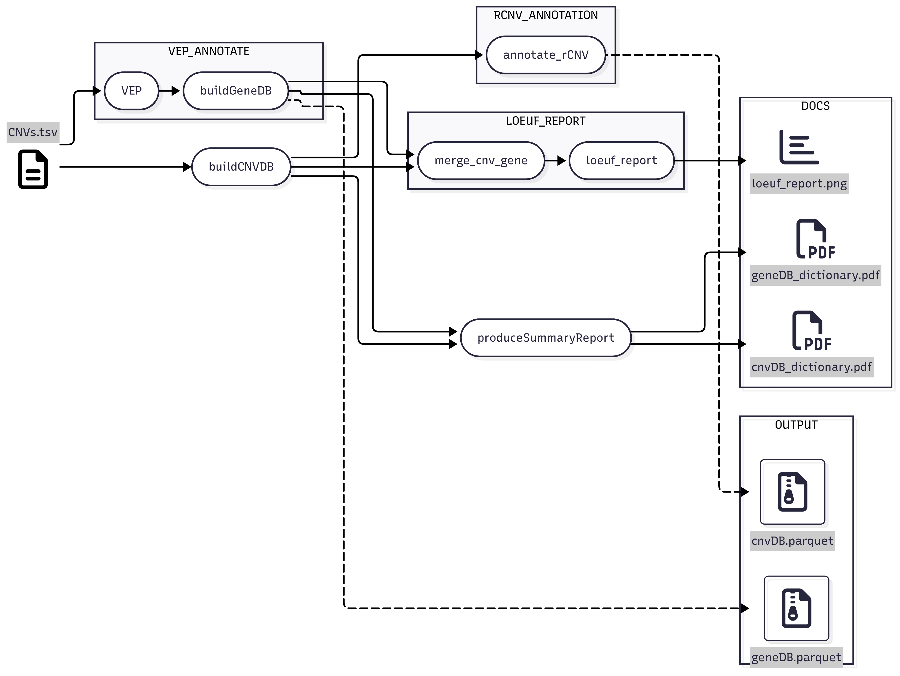

[](https://www.jacquemont-lab.org/)

[Git Repository CNV-Annotation](https://github.com/JacquemontLab/CNV-Annotation.git)

# CNV-Annotation

Nextflow pipeline for building a database from a single CNV file. The input that is expected is a TSV file with at least the following columns:

```
SampleID  Chr  Start  End  Type  [other columns preserved]
```

`Type` is a string that must be either `"DEL"` or `"DUP"`. All other columns are preserved in the output.
`Chr` should be formatted as `"chr1"`–`"chr22"`, `"chrX"`, or `"chrY"`.

### DAG
<picture>
  <source media="(prefers-color-scheme: dark)" srcset="img/CNV-Annotation-dark.png">
  <source media="(prefers-color-scheme: light)" srcset="img/CNV-Annotation-lite.png">
  
</picture>


### Dependencies

The following software and packages are required to run the CNV-Annotation pipeline:

* **Python** 3.13+
* **polars** (Python library for DataFrames)
* **duckdb** (Python library and CLI)
* **VEP** 113 (Variant Effect Predictor)
* **Nextflow** 25.04.2

All dependencies can be installed automatically using the provided installation script:

```bash
./INSTALL.sh
```

### Running the CNV annotation pipeline

Users on Compute Canada (CCDB, in the lab) are encouraged to refer directly to the script in setup/ccdb/annotate_cnv_sbatch.sh.

```bash

# Inputs:
#   -d <GIT_DIR>        Path to the root of the repository containing `main.nf` and configs.
#   -i <CNV_TSV_FILE>   Path to a TSV file containing CNVs. Must include columns:
#                        SampleID, Chr, Start, End, Type. Additional columns are preserved.
#   -g <GENOME_VERSION>  Genome build (e.g., GRCh37, GRCh38) to use for annotation.
#   -c <COHORT_TAG>      Identifier for the cohort (used in annotation and output naming).
sbatch CNV-Annotation/setup/ccdb/annotate_cnv_sbatch.sh -i /path/to/input_cnvs.tsv -g GRCh38 -c MyCohort_Name -d /path/to/CNV-Annotation
```

### Output
Minimally, there are two output tables:

#### **cnvDB.parquet**

| __dTYPE__ | __Column__ | __Description__                                    | 
|:--------- | -----------| -------------------------------------------------- |
|string     | CNV_ID             | ID of the CNV in the format of 'Chr_Start_End_Type'|
|string     | SampleID           | Cohort Specific ID for individual samples          |
|string     | Chr                | Chromosome      |
|int        | Start              | Start position. Ideally coordinates should match ensembl in that they are 1-based and inclusive.|
|int        | End                | End position.
|string     | Type               | CNV type. Either __'DEL'__ or __'DUP'__                    | 
|...| *__INPUT COLUMNS__* |                           |	
|float      | problematic_regions_Overlap  | Percentage base-pair overlap between CNV and problematic regions from UCSC.         |
|string     | rCNV_ID                | Corresponding recurrent CNV flagged, for more details see section 'Recurrent CNVs identification of the git'      |	


#### **geneDB.parquet**

| __dTYPE__ | __Column__ | __Description__                                    |
|:--------- | -----------| -------------------------------------------------- |
|string     | CNV_ID              | ID of the CNV in the format of 'Chr_Start_End_Type'|
|string     | Location            | Location ID from VEP.                               |
|string     | Allele              | CNV type. Either __'DEL'__ or __'DUP'__                    |
|string     | Gene_ID             | Ensembl ID of the __gene__ |
|string     | Transcript_ID       | Ensembl ID of the __transcript__ |
|string[]   | Consequence         | String list of Gene disruptions annotated by VEP.   | 
|string     | BIOTYPE             | Transcript classification.                 |
|boolean    | CANONICAL           | Transcript level canonical flag.                 |
|string     | MANE                | Matched Annotation from NCBI and EMBL-EBI (MANE) flag. [https://www.ncbi.nlm.nih.gov/refseq/MANE/](https://www.ncbi.nlm.nih.gov/refseq/MANE/). ⚠️ __Only available in GRCh38__ |
|string     | EXON                | String representation of the exons impacted by the CNV in the format of "<start_exon>-<end_exon>/<exon_count>" | 
|string     | INTRON              | String representation of the introns impacted by the CNV formatted as "<start_intron>-<end_intron>/<intron_count>" |
|float      | Exon_Overlap        | Number of exons overlapped by the CNV divided by the total number of exons in the transcript. See notes |
|float      | Transcript_Overlap  | Fraction of the transcript overlapped by the CNV. |
|float      | Gnomad_Max_AF       | Maximum allele frequency of matching structural variant across populations. See notes. |  
|float 	    | LOEUF		          | From gnomAD V4:upper bound of 90% confidence interval for o/e ratio for high confidence pLoF variants (lower values indicate more constrained) for the given transcript_ID |	
| string    | Gene_Name              | Gene name corresponding to the Gene_ID |	
| int       | Transcript_Start       | Start of the **transcript** (1-based, inclusive)                                   |	
| int       | Transcript_Stop        | Stop of the **transcript** (1-based, inclusive)                                     |	
| int       | Exon_count             | Number of exons in the transcript |	
| float     | Transcript_pRegion_Overlap | The basepair percentage of overlap of the transcript with a UCSC problematic region |  

The relationship between the tables relies on the CNV_ID. In the __cnvDB__, all CNVs are present, regardless of duplicates across samples. The __geneDB__ has CNVs that are deduplicated prior to running VEP. All duplicated CNVs are therefore a product of multiple transcripts belonging to the same gene. Intergenic CNVs will also be reported as either NULL in the Gene_ID column or be assigned to a gene if within 5kb of a Start/Stop codon. In the latter case, a consequence flag will be present ('upstream_gene_variant' or 'downstream_gene_variant') 


### Notes

#### Recurrent CNVs identification

A CNV is flagged has recurrent if it overlaps all the genes in the geneset of a given rCNV_ID (considering only canonical transcripts of protein-coding genes) from resources/rCNV/geneset_per_rCNV.tsv .
For a given rCNV, its geneset is constructed based on the protein-coding canonical transcripts that it overlaps at 50% (see resources/rCNV/README.md for details). If more than one rCNV_ID is identified for a given CNV, then only the one with the largest geneset is kept.

#### Consequences

Refer to VEP for exact definitions: https://useast.ensembl.org/info/genome/variation/prediction/predicted_data.html

#### LOEUF

The **LOEUF** corresponds to the `lof.oe_ci.upper` value of the associated `Transcript_ID` from [gnomAD v4.1 constraint metrics](https://storage.googleapis.com/gcp-public-data--gnomad/release/4.1/constraint/gnomad.v4.1.constraint_metrics.tsv).

⚠️ This metric is adapted for **GRCh38**: since it relies on GRCh38 transcript IDs, using it with GRCh37 may lead to mismatches or missing values for some transcripts.


#### Gnomad_Max_AF 

Gnomad Allele Frequency (AF) annotations  for structural variants (SVs) are specific to the genome version.

 __GRCh38__ uses Gnomad V4 SV sites derived from WGS. The file was downloaded from here: https://storage.googleapis.com/gcp-public-data--gnomad/release/4.1/genome_sv/gnomad.v4.1.sv.sites.vcf.gz
 
 - The fields extracted from the file are as follows:
    - AF_nfe
    - AF_afr
    - AF_amr
    - AF_fin
    - AF_sas
    - AF_eas
    - AF_asj

__GRCh37__ uses Gnomad V2 SV sites from here:
 https://storage.googleapis.com/gcp-public-data--gnomad/papers/2019-sv/gnomad_v2.1_sv.sites.vcf.gz
    
- The fields extracted from the file are as follows:
    - AFR_AF
    - AMR_AF
    - EAS_AF
    - EUR_AF 


A 70% reciprocal alignment is required for the CNV to be matched with a known SV. The maximum frequency is taken across all populations. In the event multiple gnomad SV annotations match, the maximum allele frequency is taken across SVs.

#### Exon_Overlap

By default, VEP reports CNVs that overlap with an exon in this format

    "<first_exon> - <last_exon> / <total_exon_count>"

Where "2-3/4" is a CNV that overlaps from the second to the third exon in gene of 4 exons. In order to convert this to a percentage format we apply the following function:

    Exon_Overlap = (<last_exon> - <first_exon> + 1) / <total_exon_count>

#### Transcript_Overlap

This is a default field supplied by VEP (OverlapPC). It is simply the fraction of the transcript overlapped by the CNV.
