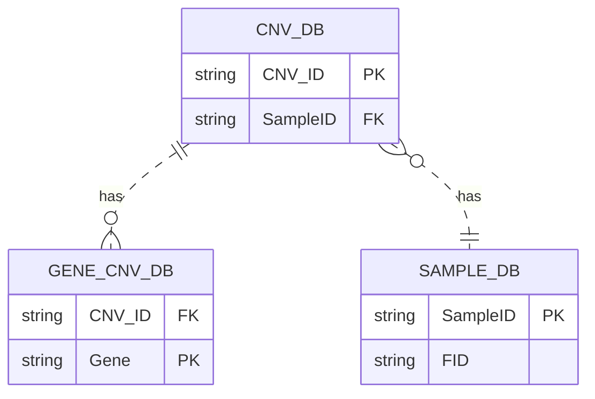
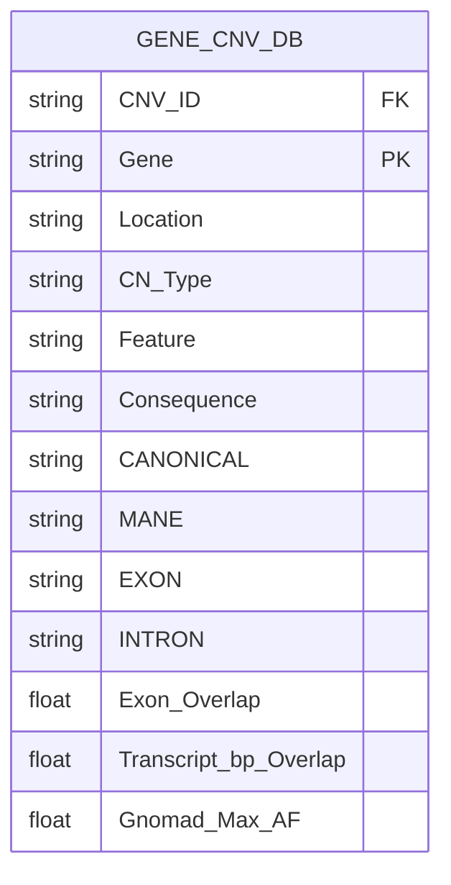
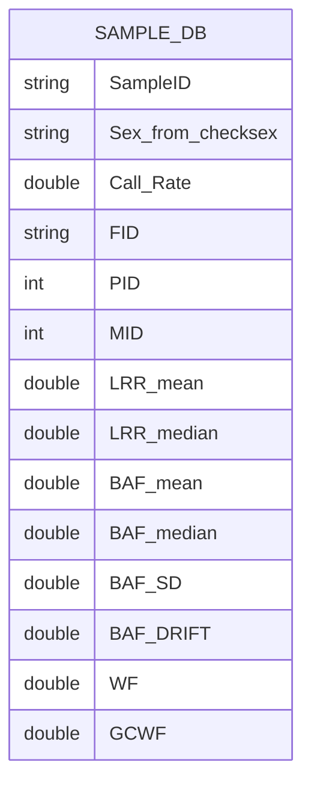

# CNV-DB-Builder

Nextflow pipeline for building a database from microarray data called from merged PennCNV and QuantiSNP CNV calls. The intent of the pipeline is to produce three .parquet files that can be referenced to each other via common IDs. The relationship between the keys are as follows:



### GENE_CNV
The pipeline utilizes VEP for annotating CNVs with gene level information from Ensembl in either Hg19 or Hg38. Here is the whole table column specification.


#### MANE 
MANE flag for transcript. Only supported in Hg38.
#### Gnomad_Max_AF 

Gnomad Allele Frequency (AF) annotations  for structural variants (SVs) are specific to the genome version.

__Hg19__ uses Gnomad V2 SV sites from here:
 https://storage.googleapis.com/gcp-public-data--gnomad/papers/2019-sv/gnomad_v2.1_sv.sites.vcf.gz
    
- The fields extracted from the file are as follows:
    - AFR_AF
    - AMR_AF
    - EAS_AF
    - EUR_AF 

 __Hg38__ uses Gnomad V4 SV sites derived from WGS. The file was downloaded from here: https://storage.googleapis.com/gcp-public-data--gnomad/release/4.1/genome_sv/gnomad.v4.1.sv.sites.vcf.gz
 
 - The fields extracted from the file are as follows:
    - AF_nfe
    - AF_afr
    - AF_amr
    - AF_fin
    - AF_sas
    - AF_eas
    - AF_asj


A 70% reciprocal alignment is required for the CNV to be matched with a known SV. The maximum frequency is taken across all populations. In the event multiple gnomad SV annotations match, the maximum allele frequency is taken across SVs.

#### Exon_Overlap

By default, VEP reports CNVs that overlap with an exon in this format

    "<first_exon> - <last_exon> / <total_exon_count>"

eg:

Where, for example, "2-3/4" is a CNV that overlaps from the second to the third exon in gene of 4 exons. In order to convert this to a percentage format we apply the following function:

    Exon_Overlap = (<last_exon> - <first_exon> + 1) / <total_exon_count>

#### Transcript_bp_Overlap

This is a default field supplied by VEP. It is simply the base pair overlap the CNV shares with a transcript.

### CNV
 The CNV table contains common quality metrics for every CNV found across individuals from both PennCNV and QuantiSNP. It also contains overlap percentages with problem regions such as Segmental duplications and centromeres. 

 ```mermaid
erDiagram
CNV_DB {
    string CNV_ID
    string SampleID
    string Chr
    int Start
    int End
    int Length
    int[]  Copy_Number
    float Confidence_max
    int Num_Probes
    int Num_Merged_CNVs
    float QuantiSNP_Overlap
    float PennCNV_Overlap
    float Two_Algorithm_Overlap
    float telomere_Overlap
    float centromere_Overlap
    float segmentaldup_Overlap
    string CN_Type


}
```

 ### SAMPLE_DB
 Individual level information, containing family relations from plink and the quality of the array. 




