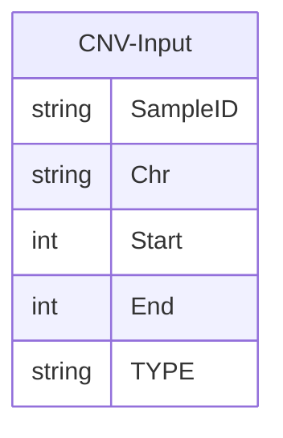

[](https://www.jacquemont-lab.org/)

# CNV-DB-Builder

Nextflow pipeline for building a database from a single CNV file. The input that is expected is a bed-like format with at least the following columns:



Where TYPE is a string that is either "DEL" or "DUP". Header names are optional while positioning is not. All other columns are passed over to the output.


### Dependencies

The following software and packages are required to run the CNV-DB-Builder pipeline:

* **Python** 3.13+
* **polars** (Python library for DataFrames)
* **duckdb** (Python library and CLI)
* **VEP** 113 (Variant Effect Predictor)
* **Nextflow** 25.04.2

All dependencies can be installed automatically using the provided installation script:

```bash
./INSTALL.sh
```


### Output
Minimally, there are two output tables:

#### cnvDB.parquet

| __dTYPE__ | __Column__ | __Description__                                    | 
|:--------- | -----------| -------------------------------------------------- |
|string     | CNV_ID             | ID of the CNV in the format of 'CHR_Start_End_Type'|
|string     | SampleID           | Cohort Specific ID for individual samples          |
|string     | Chr                | Chromosome Id. Optionally prefixed with 'Chr'      |
|int        | Start              | Chromosome start position. Ideally coordinates should match ensembl in that they are one-based and inclusive.|
|int        | End                | Chromosome End position.
|string     | Type               | CNV type. Either __'DEL'__ or __'DUP'__                    | 
|...| *__INPUT COLUMNS__* |                           |	
|float      | problematic_regions_Overlap  | Percentage base-pair overlap between CNV and problematic regions from UCSC.         |	


#### geneDB.parquet

| __dTYPE__ | __Column__ | __Description__                                    |
|:--------- | -----------| -------------------------------------------------- |
|string     | CNV_ID             | ID of the CNV in the format of 'CHR_Start_End_Type'|
|string     | Location            | Location ID from VEP                               |
|string     | Gene_ID             | Ensembl ID for the overlapping gene with the CNV. |
|string     | Transcript_ID       | Ensembl ID for the __transcript__ overlapping with the CNV |
|string[]   | Consequence         | String list of Gene disruptions annotated by VEP.   | 
|boolean    | CANONICAL           | Transcript level canonical flag.                 |
|string     | MANE                | Matched Annotation from NCBI and EMBL-EBI (MANE) flag. [https://www.ncbi.nlm.nih.gov/refseq/MANE/](https://www.ncbi.nlm.nih.gov/refseq/MANE/). __Only available in HG38__ |
|string     | EXON                | String representation of the exons impacted by the CNV in the format of "<start_exon>-<end_exon>/<exon_count>" | 
|string     | INTRON              | String representation of the introns impacted by the CNV formatted as "<start_intron>-<end_intron>/<intron_count>" |
|float      | Exon_Overlap        | Percentage transform of the EXON column. See notes |
|float      | Transcript_bp_Overlap | Base-pair percentage overlap of the transcript with the CNV. |
|float      | Gnomad_Max_AF         | Maximum allele frequency of matching structural variant across populations. See notes. |  
|float 	    | LOEUF		    | From gnomAD V4:upper bound of 90% confidence interval for o/e ratio for high confidence pLoF variants (lower values indicate more constrained) for the given transcript_ID |	
| int       | Transcript_Start       | Genomic coordinate where the **transcript** starts (1-based, inclusive)                                   |	
| int       | Transcript_End         | Genomic coordinate where the **transcript** ends (1-based, inclusive)                                     |	
| int       | Exon_count             | Number of exons in the transcript                                                                         |	


All other columns from the input are passed with their types estimated by python polars. The relationship between the tables relies on the CNV_ID. In the cnvDB, all CNVs are present, regardless of duplicates across samples. The geneDB has CNVs that are deduplicated prior to running VEP. All duplicated CNVs are therefore a product of multiple transcripts belonging to the same gene. Intergenic CNVs will also be reported as either NULL in the Gene_ID column or be assigned to a gene if within 5kb of a Start/Stop codon. In the latter case, a consequence flag will be present ('upstream_gene_variant' or 'downstream_gene_variant') 


### Notes

#### Consequences

Refer to VEP for exact definitions: https://useast.ensembl.org/info/genome/variation/prediction/predicted_data.html

#### MANE 
MANE flag for transcript. Only supported in Hg38.
#### Gnomad_Max_AF 

Gnomad Allele Frequency (AF) annotations  for structural variants (SVs) are specific to the genome version.

__Hg19__ uses Gnomad V2 SV sites from here:
 https://storage.googleapis.com/gcp-public-data--gnomad/papers/2019-sv/gnomad_v2.1_sv.sites.vcf.gz
    
- The fields extracted from the file are as follows:
    - AFR_AF
    - AMR_AF
    - EAS_AF
    - EUR_AF 

 __Hg38__ uses Gnomad V4 SV sites derived from WGS. The file was downloaded from here: https://storage.googleapis.com/gcp-public-data--gnomad/release/4.1/genome_sv/gnomad.v4.1.sv.sites.vcf.gz
 
 - The fields extracted from the file are as follows:
    - AF_nfe
    - AF_afr
    - AF_amr
    - AF_fin
    - AF_sas
    - AF_eas
    - AF_asj


A 70% reciprocal alignment is required for the CNV to be matched with a known SV. The maximum frequency is taken across all populations. In the event multiple gnomad SV annotations match, the maximum allele frequency is taken across SVs.

#### Exon_Overlap

By default, VEP reports CNVs that overlap with an exon in this format

    "<first_exon> - <last_exon> / <total_exon_count>"


Where "2-3/4" is a CNV that overlaps from the second to the third exon in gene of 4 exons. In order to convert this to a percentage format we apply the following function:

    Exon_Overlap = (<last_exon> - <first_exon> + 1) / <total_exon_count>

#### Transcript_bp_Overlap

This is a default field supplied by VEP. It is simply the base pair overlap the CNV shares with a transcript.
