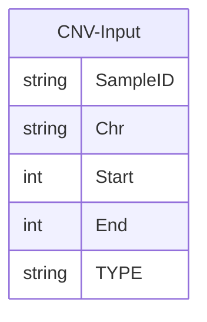
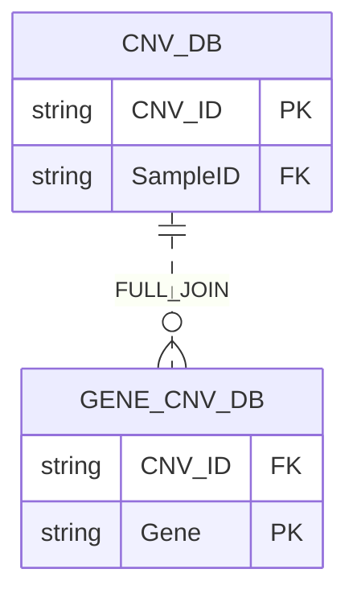

# CNV-DB-Builder-Lite

Nextflow pipeline for building a database from a single CNV file. This is a simplified implementation of the CNV-DB-Builder pipeline with only the VEP annotation. The input that is expected is a bed-like format with the  following columns:



Where TYPE is a string that is either "DEL" or "DUP". Chromosome names should all start with 'Chr', excluding X and Y. Header names are optional while positioning is not.

### Dependencies 
 - python 3.13+
 - polars 
 - duckdb 
 - vep 113
 - Nextflow 25.04.2 


### Output
 The CNV table contains a description of the CNV's location, sample of origin gene and problem area overlaps such as segdups and par regions.

 ```mermaid
erDiagram
CNV_DB {
    string CNV_ID
    string SampleID
    string Chr
    string TYPE
    int Start
    int End
    float Two_Algorithm_Overlap
    float telomere_Overlap
    float centromere_Overlap
    float segmentaldup_Overlap
    float par_Overlap
    string Gene PK
    string Feature
    string Consequence
    string CANONICAL
    string MANE
    string EXON
    string INTRON
    float Exon_Overlap
    float Transcript_bp_Overlap
    float Gnomad_Max_AF

}
```

The pipeline currently produces two parquet files and merges them with the following relationship to produce a final output:




### Notes
#### MANE 
MANE flag for transcript. Only supported in Hg38.
#### Gnomad_Max_AF 

Gnomad Allele Frequency (AF) annotations  for structural variants (SVs) are specific to the genome version.

__Hg19__ uses Gnomad V2 SV sites from here:
 https://storage.googleapis.com/gcp-public-data--gnomad/papers/2019-sv/gnomad_v2.1_sv.sites.vcf.gz
    
- The fields extracted from the file are as follows:
    - AFR_AF
    - AMR_AF
    - EAS_AF
    - EUR_AF 

 __Hg38__ uses Gnomad V4 SV sites derived from WGS. The file was downloaded from here: https://storage.googleapis.com/gcp-public-data--gnomad/release/4.1/genome_sv/gnomad.v4.1.sv.sites.vcf.gz
 
 - The fields extracted from the file are as follows:
    - AF_nfe
    - AF_afr
    - AF_amr
    - AF_fin
    - AF_sas
    - AF_eas
    - AF_asj


A 70% reciprocal alignment is required for the CNV to be matched with a known SV. The maximum frequency is taken across all populations. In the event multiple gnomad SV annotations match, the maximum allele frequency is taken across SVs.

#### Exon_Overlap

By default, VEP reports CNVs that overlap with an exon in this format

    "<first_exon> - <last_exon> / <total_exon_count>"


Where "2-3/4" is a CNV that overlaps from the second to the third exon in gene of 4 exons. In order to convert this to a percentage format we apply the following function:

    Exon_Overlap = (<last_exon> - <first_exon> + 1) / <total_exon_count>

#### Transcript_bp_Overlap

This is a default field supplied by VEP. It is simply the base pair overlap the CNV shares with a transcript.


