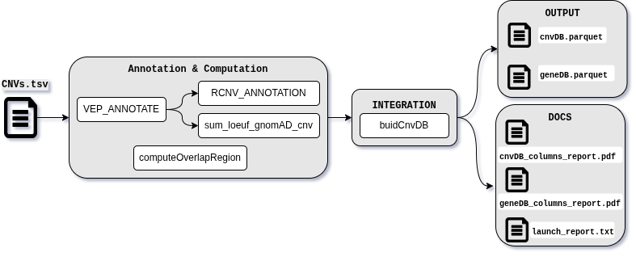

[](https://www.jacquemont-lab.org/)

[Git Repository CNV-Annotation](https://github.com/JacquemontLab/CNV-Annotation.git)

[](https://doi.org/10.5281/zenodo.18607264)


# CNV-Annotation

## Overview

A reproducible Nextflow pipeline developed by the Jacquemont Lab for the systematic annotation of copy number variants (CNVs).  
Starting from a single cohort-level CNV TSV file, the pipeline integrates genomic context, gene and transcript disruption, population frequency, constraint metrics, and known recurrent CNVs to produce analysis-ready databases in Parquet format.

The workflow is designed for large-scale cohort studies, supports both **GRCh37** and **GRCh38**, and prioritizes canonical and MANE transcripts to balance biological interpretability and database size.


## Requirements

Refer to the template config files and adjust them to match your infrastructure.

Required software:

* **Nextflow** – workflow engine (nextflow version 25.10.2)
* **Docker** (Apptainer or Singularity) – to run containers

You might need to pull the following containers if working **offline**, or you can try using conda (see `nextflow.config`):
* **docker://ghcr.io/jacquemontlab/python_packages:latest**
* **docker://ghcr.io/jacquemontlab/ensembl_113:latest**
* **docker://ghcr.io/jacquemontlab/cnv_dataset_report_latest:latest**

### Download required VEP cache files 

Run the installation script to automatically download all reference resources required by the pipeline, including VEP cache files, gnomAD structural variant data, and constraint metrics, for the selected genome build (GRCh37 and GRCh38 only). This script can take quite some time >1 hour.

From the root directory of the repository, run the following command to save the data in `./resources/vep_cache` (tabix and requirement should be provided by the Docker image):

```bash
docker run --rm -it \
  -v "$PWD":/CNV-Annotation \
  -w /CNV-Annotation \
  ghcr.io/jacquemontlab/tabix:latest \
  bash INSTALL.sh -g GRCh38
```


## Inputs

| Parameter          | Description                                         | Default    |
| ------------------ | --------------------------------------------------- | ---------- |
| `--genome_version` | Human genome assembly version. (accepted: `GRCh38`\|`GRCh37`) | GRCh38     |
| `--cnvs`           | TSV file containing CNVs. <details><summary>Format</summary><small>With at least `SampleID  Chr  Start  End  Type`. All other columns are preserved in the output.<br> `Type` is a string that must be either `"DEL"` or `"DUP"`.<br> `Chr` should be formatted as `"chr1"`–`"chr22"`, `"chrX"`, or `"chrY"`.</small></details>     | *Required* |
| `--dataset_name`   | Name of the dataset, used for directory and report naming.    | dataset    |
| `--vep_cache`      | Path to the VEP cache directory                               | ${projectDir}/resources/vep_cache |


## Usage

### Testing

The pipeline can be tested using the test profile and the images hosted on github using the container platform of your choice. 

```bash
container=docker # or apptainer or singularity

nextflow run main.nf -profile test,${container} --genome_version GRCh38
```

### Example

```bash
genome_version=GRCh38
sample_file=$PWD/tests/cnvs_10k.tsv
vep_cache=$PWD/resources/vep_cache
container=docker # or apptainer or singularity

nextflow run main.nf \
    --dataset_name Dataset \
    --cnvs "$sample_file" \
    --vep_cache "$vep_cache" \
    --genome_version "$genome_version" \
    -profile ${container}
```


### Users on Compute Canada (CCDB, in the lab) are encouraged to refer directly to the script in setup/ccdb/annotate_cnv_sbatch.sh.

```bash
# Inputs:
#   -d <GIT_DIR>        Path to the root of the repository containing `main.nf` and configs.
#   -i <CNV_TSV_FILE>   Path to a TSV file containing CNVs. Must include columns:
#                        SampleID, Chr, Start, End, Type. Additional columns are preserved.
#   -g <GENOME_VERSION>  Genome build (e.g., GRCh37, GRCh38) to use for annotation.
#   -c <DATASET_NAME>    Identifier for the dataset (used in annotation and output naming).
sbatch /lustre09/project/6008022/LAB_WORKSPACE/SOFTWARE/Git_pipeline/CNV-Annotation/setup/ccdb/annotate_cnv_sbatch.sh \
-i /path/to/input_cnvs.tsv -g GRCh38 -c MyDataset_Name
```


## Outputs

There are two output tables and in `docs/` are saved their corresponding `columns_report.pdf`.
Also, for downstream analyses, we recommend filtering the final CNV set considering `docs/cnv_dataset_qc.pdf`.


#### **cnvDB.parquet**

| __Data type__ | __Column__ | __Description__                                    | 
| --------- | -----------| -------------------------------------------------- |
|string     | **CNV_ID**             | ID of the CNV in the format of 'Chr_Start_End_Type'|
|string     | **SampleID**           | Cohort Specific ID for individual samples          |
|string     | **Chr**                | Chromosome      |
|int        | **Start**              | Start position. Ideally coordinates should match ensembl in that they are 1-based and inclusive.|
|int        | **End**                | End position.
|string     | **Type**               | CNV type. Either __'DEL'__ or __'DUP'__                    | 
|...| *__INPUT COLUMNS__* |                           |	
|float      | **ProblematicRegions_Overlap**  | Percentage base-pair overlap between CNV and problematic regions (Segmental Duplications, Major Histocompatibility Complex, Centromeres, Telomeres, and UCSC Problematic Regions), for more details see section 'Problematic Regions'.         |
|int        | **sum_LOEUF**              | Sum of the LOEUF values of canonical transcripts whose exons are overlapped by the CNV. |	
|float      | **Gnomad_Max_AF**          | Maximum allele frequency of matching structural variant across populations. See section 'Gnomad_Max_AF'. |  
|string     | **rCNV_ID**                | Corresponding recurrent CNV flagged, for more details see section 'Recurrent CNVs identification'. |	


#### **geneDB.parquet**

| __Data type__ | __Column__ | __Description__                                    |
| --------- | -----------| -------------------------------------------------- |
|string     | **CNV_ID**              | ID of the CNV in the format of 'Chr_Start_End_Type'|
|string     | **Location**            | Location ID from VEP.                               |
|string     | **Allele**              | CNV type. Either __'DEL'__ or __'DUP'__                    |
|string     | **Gene_ID**             | Ensembl ID of the __gene__ |
|string     | **Transcript_ID**       | Ensembl ID of the __transcript__ |
|string[]   | **Consequence**         | String list of Gene disruptions annotated by VEP.   | 
|string     | **BIOTYPE**             | Transcript classification.                 |
|boolean    | **CANONICAL**           | Transcript level canonical flag.                 |
|string     | **MANE**                | Matched Annotation from NCBI and EMBL-EBI (MANE) flag. [https://www.ncbi.nlm.nih.gov/refseq/MANE/](https://www.ncbi.nlm.nih.gov/refseq/MANE/). ⚠️ __Only available in GRCh38__ |
|string     | **EXON**                | String representation of the exons impacted by the CNV in the format of "<start_exon>-<end_exon>/<exon_count>" | 
|string     | **INTRON**              | String representation of the introns impacted by the CNV formatted as "<start_intron>-<end_intron>/<intron_count>" |
|float      | **Exon_Overlap**        | Number of exons overlapped by the CNV divided by the total number of exons in the transcript. See notes |
|float      | **Transcript_Overlap**  | Fraction of the transcript overlapped by the CNV. |
|float 	    | **LOEUF**		          | From gnomAD V4:upper bound of 90% confidence interval for o/e ratio for high confidence pLoF variants (lower values indicate more constrained) for the given transcript_ID |	
| string    | **Gene_Name**              | Gene name corresponding to the Gene_ID |	
| int       | **Transcript_Start**       | Start of the **transcript** (1-based, inclusive)                                   |	
| int       | **Transcript_Stop**        | Stop of the **transcript** (1-based, inclusive)                                     |	
| int       | **Exon_count**             | Number of exons in the transcript |	
| float     | **Transcript_ProblematicRegions_Overlap** | The basepair percentage of overlap of the transcript with problematic regions (Segmental Duplications, Major Histocompatibility Complex, Centromeres, Telomeres, and UCSC Problematic Regions), for more details see section 'Problematic Regions'. |  


### Notes on relationships between tables

* The **CNV\_ID** links the `cnvDB` and `geneDB` tables.
* `cnvDB` contains all CNVs, including duplicates across samples.
* `geneDB` contains deduplicated CNVs prior to running VEP. Any duplicates in this table arise only when a CNV affects multiple gene or transcript, but only **MANE or CANONICAL transcripts** are retained to reduce the database size.
* Intergenic CNVs are either NULL in `Gene_ID` or assigned to the nearest gene within 5kb of a start/stop codon, with a consequence flag: `'upstream_gene_variant'` or `'downstream_gene_variant'` (see [Ensembl VEP Consequences](https://useast.ensembl.org/info/genome/variation/prediction/predicted_data.html)).


## Notes

### Workflow Structure
<picture>
  
</picture>


### Problematic Regions

This region regroups multiple tables from UCSC: Segmental Duplications, Major Histocompatibility Complex, Centromeres, Telomeres, and Problematic Regions from UCSC.
For details, please refer to the file `CNV-Annotation/resources/Genome_Regions/README.md` 

### Recurrent CNVs identification

A CNV is flagged has recurrent if it overlaps all the genes in the geneset of a given rCNV_ID (considering only canonical transcripts of protein-coding genes) from `resources/rCNV/geneset_per_rCNV.tsv` .
For a given rCNV, its geneset is constructed based on the protein-coding canonical transcripts that it overlaps at 50% (see `resources/rCNV/README.md` for details). If more than one rCNV_ID is identified for a given CNV, then only the one with the largest geneset is kept.

### Consequences

Refer to VEP for exact definitions: https://useast.ensembl.org/info/genome/variation/prediction/predicted_data.html

### LOEUF

The **LOEUF** corresponds to the `lof.oe_ci.upper` value of the associated `Transcript_ID` from [gnomAD v4.1 constraint metrics](https://storage.googleapis.com/gcp-public-data--gnomad/release/4.1/constraint/gnomad.v4.1.constraint_metrics.tsv).

⚠️ This metric is adapted for **GRCh38**: since it relies on GRCh38 transcript IDs, using it with GRCh37 may lead to mismatches or missing values for some transcripts.


### Gnomad_Max_AF 

Gnomad Allele Frequency (AF) annotations for structural variants (SVs) are specific to the genome version.

 __GRCh38__ uses Gnomad V4 SV sites derived from WGS. The file was downloaded from here: https://storage.googleapis.com/gcp-public-data--gnomad/release/4.1/genome_sv/gnomad.v4.1.sv.sites.vcf.gz
 
 - The fields extracted from the file are as follows:
    - AF_nfe
    - AF_afr
    - AF_amr
    - AF_fin
    - AF_sas
    - AF_eas
    - AF_asj

__GRCh37__ uses Gnomad V2 SV sites from here:
 https://storage.googleapis.com/gcp-public-data--gnomad/papers/2019-sv/gnomad_v2.1_sv.sites.vcf.gz
    
- The fields extracted from the file are as follows:
    - AFR_AF
    - AMR_AF
    - EAS_AF
    - EUR_AF 


A 70% reciprocal alignment is required for the CNV to be matched with a known SV. The maximum frequency is taken across all populations. In the event multiple gnomad SV annotations match, the maximum allele frequency is taken across SVs.

### Exon_Overlap

By default, VEP reports CNVs that overlap with an exon in this format

    "<first_exon> - <last_exon> / <total_exon_count>"

Where "2-3/4" is a CNV that overlaps from the second to the third exon in gene of 4 exons. In order to convert this to a percentage format we apply the following function:

    Exon_Overlap = (<last_exon> - <first_exon> + 1) / <total_exon_count>

### Transcript_Overlap

This is a default field supplied by VEP (OverlapPC). It is simply the fraction of the transcript overlapped by the CNV.
